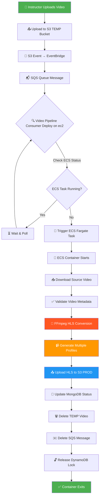
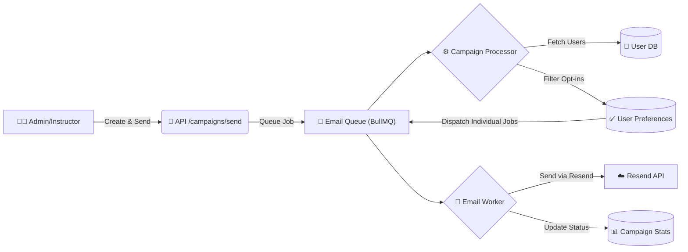
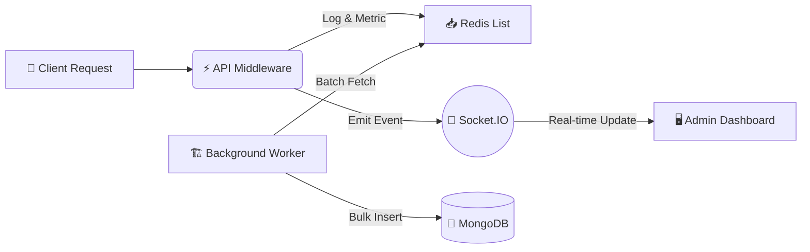

<div align="center">

# 🎓 EduApp 2026

### A Modern Full-Stack Educational Platform Inspired by `link https://www.sheryians.com `

[](https://github.com/Adityakbr01/eduApp2026)
[](https://opensource.org/licenses/ISC)
[](https://nextjs.org/)
[](https://www.typescriptlang.org/)
[](https://reactjs.org/)

**A seamless learning experience with video content, progress tracking, assessments, and user enrollment management.**

[🚀 Getting Started](#-installation--setup) • [📖 Features](#-features) • [🤝 Contributing](#-contribution-guidelines) • [🐛 Issues](https://github.com/Adityakbr01/eduApp2026/issues) • [⭐ Star Us](https://github.com/Adityakbr01/eduApp2026)

</div>

---

## �️ Tech Stack

### 🎨 Frontend

-  **Next.js 16** with React 19
-  **TypeScript** for type safety
-  **Tailwind CSS 4** for styling
- **State Management:** Zustand
- **Data Fetching:** TanStack React Query
- **UI Components:** Radix UI, Lucide Icons
- **Animations:** GSAP, Framer Motion (Motion Library)
- **Form Handling:** React Hook Form + Zod validation
- **Other Libraries:** React Dropzone, React Markdown, Swiper

### ⚙️ Backend

-  **Node.js** with Express 5
-  **TypeScript** for business logic
-  **MongoDB** with Mongoose ODM
-  **Redis** for caching & sessions
- **Queue Management:** BullMQ
- **Authentication:** JWT (jsonwebtoken) + bcryptjs
- **File Storage:** AWS S3, Cloudinary
- **Email Service:** Resend
- **Payments:** Razorpay
- **Security:** Helmet, CORS, HPP, XSS protection, Rate Limiting

### 🚀 DevOps & Infrastructure

-  **Docker** & Docker Compose
-  **AWS ECS** for video processing workers
- **Logging:** Winston with daily log rotation
- **CI/CD:** GitHub Actions ready

---

## ✨ Features

- 🔐 **Authentication & Authorization** — Secure JWT-based auth with refresh tokens
- 👥 **Role-Based Access Control (RBAC)** — Granular permissions for users, instructors, and admins
- 📖 **Course Management** — Create, organize, and publish structured courses with sections and lessons
- 🎥 **Video Content Delivery** — HLS video streaming with background processing pipeline
- 📊 **Progress Tracking** — Track learner progress across courses, sections, and lessons
- 📝 **Assessments & Quizzes** — Built-in assessment system for knowledge evaluation
- 💳 **Payment Integration** — Seamless course purchases via Razorpay
- ⭐ **Reviews & Ratings** — Students can rate and review courses
- 🌙 **Dark Mode Support** — Beautiful UI with theme switching
- 📱 **Responsive Design** — Optimized for all screen sizes
- 🚀 **Performance Optimized** — Redis caching, rate limiting, and CDN-ready assets

---

## 🎬 HLS Video Processing Pipeline

EduApp includes a **production-grade video processing system** that converts uploaded videos to HLS (HTTP Live Streaming) format with multiple quality profiles using AWS ECS Fargate.

### 🏗️ Architecture Overview



### 📋 Processing Workflow

#### 1️⃣ **Video Upload & Event Triggering**

- Instructor uploads `.mp4` video to **temporary S3 bucket**
- S3 event triggers **AWS EventBridge** rule
- Message sent to **SQS queue** for reliable processing

#### 2️⃣ **Pipeline Consumer (Scheduler)**

Located in: `video-pipline-consumer/`

**Responsibilities:**

- Polls SQS queue for new video jobs
- Checks if ECS task is already running (prevents concurrent tasks)
- Triggers **AWS ECS Fargate task** when worker is idle
- Implements retry logic and error handling

**Key Features:**

- ⏸️ Single-task concurrency control
- 🔄 Continuous polling with configurable intervals
- 🛡️ Message validation and filtering
- 📊 DynamoDB-based job status tracking

#### 3️⃣ **ECS Video Worker (FFmpeg Processor)**

Located in: `server/video-worker-ecs/`

**Processing Steps:**

1. **Download** source video from S3 TEMP bucket
2. **Validate** video metadata (duration, codec, size)
3. **Convert** to HLS format using FFmpeg with multiple profiles:
   - **360p** (640px width) — 800kbps bitrate
   - **720p** (1280px width) — 2800kbps bitrate
   - _(1080p optional)_ — Configurable
4. **Generate** adaptive bitrate streaming files:
   - `master.m3u8` — Master playlist
   - `360/index.m3u8`, `720/index.m3u8` — Quality-specific playlists
   - `.ts` segment files — Video chunks
5. **Upload** all HLS files to S3 PROD bucket
6. **Update** MongoDB lesson content status to `READY`
7. **Cleanup** temporary files and delete source video
8. **Release** DynamoDB lock and delete SQS message
9. **Exit** container gracefully

### 🎯 Video Quality Profiles

| Profile   | Resolution | Bitrate | Max Rate | Buffer Size | Use Case                       |
| --------- | ---------- | ------- | -------- | ----------- | ------------------------------ |
| **360p**  | 640×360    | 800k    | 900k     | 1200k       | Mobile / Low bandwidth         |
| **720p**  | 1280×720   | 2800k   | 3000k    | 4200k       | Desktop / HD streaming         |
| **1080p** | 1920×1080  | 5000k   | 5500k    | 8000k       | Premium / Full HD _(optional)_ |

### 🔧 Technical Components

#### FFmpeg Configuration

```typescript
// Multi-resolution HLS conversion
- Codec: H.264 (libx264)
- Audio: AAC 128k stereo
- HLS Segment Duration: 6 seconds
- GOP Size: Optimized for seeking
- Pixel Format: yuv420p
- Enhancement: Sharp scaling filter
```

#### AWS Infrastructure

- **ECS Fargate**: Serverless container execution
- **S3 Buckets**:
  - `TEMP` — Temporary raw video storage
  - `PROD` — Final HLS output with CDN integration
- **SQS**: Message queue for job management
- **DynamoDB**: Job locking and status tracking
- **EventBridge**: Event-driven architecture

#### Worker Features

- 💓 **Heartbeat mechanism** — Keeps DynamoDB lock alive during processing
- 🔄 **Graceful shutdown** — Proper cleanup on success/failure
- 📊 **Duration extraction** — Automatically calculates video length
- 🎵 **Audio detection** — Handles videos with/without audio tracks
- 🛡️ **Error recovery** — Marks failed jobs for manual review

### 📦 Environment Variables (Video Worker)

```env
# AWS Configuration
AWS_REGION=us-east-1
AWS_ACCESS_KEY_ID=your_access_key
AWS_SECRET_ACCESS_KEY=your_secret_key

# S3 Buckets
VIDEO_BUCKET_TEMP=eduapp-videos-temp
VIDEO_BUCKET_PROD=eduapp-videos-prod

# SQS
SQS_QUEUE_URL=https://sqs.us-east-1.amazonaws.com/xxx/video-queue
SQS_RECEIPT_HANDLE=<runtime_value>

# DynamoDB
DYNAMO_TABLE=video-processing-jobs

# MongoDB
MONGODB_URI=mongodb://xxx
MONGODB_DB_NAME=eduapp

# Video Processing
VIDEO_KEY=<runtime_s3_key>
```

### 🚀 Deployment

**Build Docker Image:**

```bash
cd server/video-worker-ecs
docker build -t eduapp-video-worker .
docker push your-registry/eduapp-video-worker:latest
```

**Start Pipeline Consumer:**

```bash
cd video-pipline-consumer
npm run build
npm start
```

### 📊 Monitoring & Debugging

- **CloudWatch Logs**: ECS task logs for FFmpeg output
- **DynamoDB Table**: Real-time job status tracking
- **SQS Metrics**: Queue depth and message age
- **S3 Events**: Monitor upload/processing rates

---

## 📧 Email Campaign System

The platform features a robust, scalable email campaign system designed to handle high-volume marketing and notification emails efficiently using **BullMQ** and **Redis**.

### 🏗️ Architecture & Strategy

The email system is built on a **producer-consumer** pattern to decouple the API from the heavy lifting of email dispatching.



#### 1️⃣ **Campaign Creation & Targeting**

- **Drafting**: Campaigns are created with rich text content (HTML) and subject lines.
- **Targeting**: Supports granular targeting:
  - **Roles**: All Users, Students, Instructors, Managers.
  - **Specific Users**: List of user IDs.
- **AI Integration**:
  - **Content Generation**: AI generates email body based on tone and key points.
  - **Subject Suggestions**: AI suggests catchy subject lines to improve open rates.

#### 2️⃣ **Job Processing Strategy**

The system uses a **two-step job dispatch strategy** to ensure scalability:

1.  **Macro Job (`process-campaign`)**:
    - The API pushes a single job to the queue with the `campaignId`.
    - The **Campaign Processor** fetches the campaign, queries the database for all matching recipients, and filters them based on **User Preferences** (marketing opt-in).
    - It then **fans out** by creating individual `send-marketing-email` jobs for each eligible recipient back into the queue.

2.  **Micro Job (`send-marketing-email`)**:
    - These small, lightweight jobs are picked up by workers in parallel.
    - Each job handles sending a single email and updating the individual sent/failed status.
    - This prevents a single massive campaign from blocking the queue and allows for granular retries.

### ♻️ BullMQ & Scalability

The system is configured for high throughput and reliability:

- **Queue Name**: `email-queue`
- **Concurrency**: Configurable via `BULLMQ_WORKER_CONCURRENCY` (default: 5-10 parallel jobs per worker).
- **Rate Limiting**: Enforced per job type to respect email provider quotas (e.g., specific limits for OTPs vs. Marketing emails).
- **Retries & Backoff**:
  - Failed email jobs are retried up to **5 times** with **exponential backoff**.
  - Ensures temporary network issues or provider downtime don't cause campaign failures.
- **Priority Management**:
  - **High Priority**: OTPs, Password Resets (processed immediately).
  - **Normal Priority**: Marketing Campaigns (processed in background).

### 🛠️ Key Components

| Component              | Path                                                           | Description                                          |
| ---------------------- | -------------------------------------------------------------- | ---------------------------------------------------- |
| **Queue**              | `server/src/bull/queues/email.queue.ts`                        | BullMQ queue configuration.                          |
| **Worker**             | `server/src/bull/workers/email.worker.ts`                      | Worker instance processing jobs.                     |
| **Campaign Processor** | `server/src/bull/processors/email/processCampaignProcessor.ts` | Logic to logical target users and dispatch sub-jobs. |
| **Email Service**      | `server/src/services/emailCampaign.service.ts`                 | Business logic for creating/managing campaigns.      |

---

## � API Monitoring & System Health

A comprehensive, real-time monitoring solution is built-in to track API performance, server health, and application logs.

### 🌟 Key Features

- **Live Dashboard**: Real-time visualization of traffic, latency, and error rates using **Socket.IO**.
- **System Health**: Monitor Server CPU, Memory, and Uptime via `systeminformation`.
- **Request Logging**: Detailed logs for every API request with filtering and pagination.
- **Traceability**: Unique `traceId` for end-to-end request tracking.

### 🏗️ Scalable Architecture

The monitoring system is designed for high performance and minimal impact on API latency:



#### 1️⃣ **Redis Buffering**

- Instead of writing every log directly to MongoDB (which is slow), middleware pushes logs to a **Redis List** (`monitoring:logs`, `monitoring:metrics`).
- This ensures **O(1)** write performance, adding negligible overhead to requests.

#### 2️⃣ **Batch Processing**

- A background **Worker** (running every 5s) consumes data from Redis in batches (e.g., 100 logs at a time).
- It performs **bulk inserts** into MongoDB, significantly reducing database efficient connection usage.

#### 3️⃣ **Real-Time WebSockets**

- **Socket.IO** is used to stream live events to the dashboard.
- Configured with **Redis Adapter** to support horizontal scaling (multiple server instances).

### 🖥️ Dashboard Components

| Component          | Description                                                       |
| :----------------- | :---------------------------------------------------------------- |
| **System Health**  | Live CPU load, RAM usage, and Server Uptime.                      |
| **Overview Cards** | Live counters for Total Requests, Error Rate, and Avg Latency.    |
| **Metrics Chart**  | Responsive chart showing traffic trends over the last hour.       |
| **Live Logs**      | Scrollable list of recent requests with status codes and latency. |

---

## �📁 Folder Structure

```
eduApp/
├── client/                      # Next.js Frontend
│   ├── app/                     # App Router (pages & routes)
│   │   └── (routes)/            # Route groups
│   │       ├── (auth)/          # Authentication pages
│   │       ├── courses/         # Course listing
│   │       ├── course/          # Individual course view
│   │       ├── dashboard/       # User/Admin dashboard
│   │       └── profile/         # User profile
│   ├── components/              # Reusable UI components
│   │   ├── ui/                  # Base UI components
│   │   ├── pages/               # Page-specific components
│   │   ├── form/                # Form components
│   │   ├── modals/              # Modal dialogs
│   │   └── Layouts/             # Layout wrappers
│   ├── hooks/                   # Custom React hooks
│   ├── lib/                     # Utility functions
│   ├── services/                # API service layer
│   ├── store/                   # Zustand stores
│   ├── validators/              # Zod schemas
│   ├── constants/               # App constants
│   └── Providers/               # Context providers
│
├── server/                      # Express Backend
│   ├── src/
│   │   ├── controllers/         # Route handlers
│   │   ├── services/            # Business logic
│   │   ├── models/              # Mongoose schemas
│   │   ├── routes/              # API routes
│   │   ├── middlewares/         # Express middlewares
│   │   │   ├── system/          # Core middlewares
│   │   │   └── custom/          # Custom middlewares
│   │   ├── repositories/        # Data access layer
│   │   ├── cache/               # Redis caching logic
│   │   ├── bull/                # Job queue processors
│   │   ├── configs/             # Configuration files
│   │   ├── helpers/             # Helper functions
│   │   ├── utils/               # Utility modules
│   │   ├── types/               # TypeScript types
│   │   ├── schemas/             # Validation schemas
│   │   └── seeds/               # Database seeders
│   │
│   └── video-worker-ecs/        # 🎬 ECS Video Processing Worker
│       ├── ffmpeg/              # FFmpeg HLS conversion logic
│       │   ├── generateHLS.ts   # Main HLS generator
│       │   ├── profiles.ts      # Video quality profiles
│       │   ├── hlsBuilder.ts    # FFmpeg args builder
│       │   ├── hasAudio.ts      # Audio stream detection
│       │   └── getVideoDuration.ts  # Duration extraction
│       ├── workers/
│       │   └── videoWorker.ts   # Main worker entry point
│       ├── aws/                 # AWS S3/SQS/DynamoDB clients
│       ├── db/                  # MongoDB connection
│       ├── utils/               # Helper utilities
│       └── Dockerfile           # Container image
│
├── video-pipline-consumer/      # 📡 SQS Consumer & ECS Scheduler
│   ├── workers/
│   │   └── videoProcessor.worker.ts  # ECS task scheduler
│   ├── service/
│   │   ├── sqs.service.ts       # SQS message handling
│   │   └── ecs.service.ts       # ECS task management
│   └── Dockerfile               # Consumer container
│
└── docker-compose.prod.yml      # Production Docker config
```

---

## 🔧 Environment Variables

### Client (`client/.env.local`)

```env
NEXT_PUBLIC_API_URL=http://localhost:5000/api/v1
NEXT_PUBLIC_APP_URL=http://localhost:3000
```

### Server (`server/.env`)

```env
# Application
NODE_ENV=development
PORT=3001

# Database
MONGODB_URI=mongodb://localhost:27017/eduapp

# Redis
REDIS_HOST=localhost
REDIS_PORT=6379

# JWT
ACCESS_TOKEN_SECRET=your_access_token_secret
REFRESH_TOKEN_SECRET=your_refresh_token_secret
ACCESS_TOKEN_EXPIRES_IN=15m
REFRESH_TOKEN_EXPIRES_IN=7d

# AWS S3
AWS_ACCESS_KEY_ID=your_aws_key
AWS_SECRET_ACCESS_KEY=your_aws_secret
AWS_REGION=us-east-1
AWS_S3_BUCKET=your_bucket_name

# Cloudinary
CLOUDINARY_CLOUD_NAME=your_cloud_name
CLOUDINARY_API_KEY=your_api_key
CLOUDINARY_API_SECRET=your_api_secret

# Razorpay
RAZORPAY_KEY_ID=your_razorpay_key
RAZORPAY_KEY_SECRET=your_razorpay_secret

# Email (Resend)
RESEND_API_KEY=your_resend_key
```

---

## 🚀 Installation & Setup

### 📋 Prerequisites

- Node.js 20+
- MongoDB 7+
- Redis 7+
- npm or yarn

### 📦 Clone the Repository

```bash
git clone https://github.com/Adityakbr01/eduApp2026.git
cd eduApp2026
```

### 📥 Install Dependencies

```bash
# Install client dependencies
cd client
npm install

# Install server dependencies
cd ../server
npm install
```

### 🌱 Seed the Database

```bash
cd server
npm run seed:all
```

---

## ▶️ Running the App

### 💻 Development Mode

**Terminal 1 — Backend:**

```bash
cd server
npm run dev
```

**Terminal 2 — Frontend:**

```bash
cd client
npm run dev
```

- Frontend: [http://localhost:3000](http://localhost:3000)
- Backend API: [http://localhost:5000/api/v1](http://localhost:5000/api/v1)

### 🏭 Production Mode

**Build and start the frontend:**

```bash
cd client
npm run build
npm run start
```

**Build and start the backend:**

```bash
cd server
npm run build
npm run start
```

---

## 📜 Scripts / Commands

### Client

| Command         | Description              |
| --------------- | ------------------------ |
| `npm run dev`   | Start development server |
| `npm run build` | Build for production     |
| `npm run start` | Start production server  |
| `npm run lint`  | Run ESLint               |

### Server

| Command                   | Description                              |
| ------------------------- | ---------------------------------------- |
| `npm run dev`             | Start development server with hot reload |
| `npm run build`           | Compile TypeScript                       |
| `npm run start`           | Start production server                  |
| `npm run seed:rbac`       | Seed roles and permissions               |
| `npm run seed:categories` | Seed course categories                   |
| `npm run seed:all`        | Run all seed scripts                     |

---

## 🚢 Deployment Notes

### 🐳 Docker Deployment

The application includes production-ready Docker configuration:

```bash
docker-compose -f docker-compose.prod.yml up -d
```

**Services Started:**

- `eduapp_frontend` — Next.js frontend (port 3000)
- `eduapp_backend` — Express API (port 5000)
- `eduapp_redis` — Redis cache
- `eduapp_video_worker` — Video processing worker

### ✅ Manual Deployment Checklist

1. Set all environment variables on your production server
2. Ensure MongoDB is accessible and connection string is correct
3. Configure Redis for session/cache storage
4. Set up AWS S3 buckets with proper CORS policies
5. Configure Cloudinary for image uploads
6. Set up Razorpay webhook endpoints
7. Enable HTTPS via reverse proxy (nginx/Caddy)
8. Configure DNS and SSL certificates

---

## ⚡ Performance & Optimization Notes

- **Redis Caching** — API responses and session data are cached for faster access
- **Rate Limiting** — Protects APIs from abuse with configurable limits
- **Response Compression** — Gzip compression enabled for all responses
- **Image Optimization** — Cloudinary handles responsive image delivery
- **Code Splitting** — Next.js automatic code splitting for faster page loads
- **Static Generation** — Public pages leverage ISR/SSG where applicable
- **Bundle Analysis** — Keep eye on client bundle size during development
- **Database Indexing** — MongoDB collections have optimized indexes

---

## 🔒 Security Best Practices

- **Helmet.js** — Sets secure HTTP headers
- **CORS** — Configured with specific origin whitelist
- **HPP Protection** — Prevents HTTP Parameter Pollution
- **XSS Prevention** — Input sanitization with xss library
- **Rate Limiting** — Redis-backed rate limiter protects all endpoints
- **JWT Tokens** — Short-lived access tokens with secure refresh flow
- **Password Hashing** — bcrypt for secure password storage
- **Input Validation** — Zod schemas validate all incoming requests
- **HTTP-Only Cookies** — Auth tokens stored in secure cookies
- **Environment Secrets** — Sensitive data never committed to repository

---

## 🤝 Contribution Guidelines

We welcome contributions! Please follow these steps:

1. **Fork** the repository
2. **Create** a feature branch: `git checkout -b feature/amazing-feature`
3. **Commit** your changes: `git commit -m 'Add amazing feature'`
4. **Push** to the branch: `git push origin feature/amazing-feature`
5. **Open** a Pull Request

### 📝 Code Guidelines

- Follow existing code style and conventions
- Write meaningful commit messages
- Add tests for new features when applicable
- Update documentation for significant changes
- Ensure all linters pass before submitting

---

## 📄 License

This project is licensed under the **ISC License**.

---

<div align="center">

### 🌟 Show Your Support

If you find this project helpful, please consider giving it a ⭐ on [GitHub](https://github.com/Adityakbr01/eduApp2026)!

[](https://github.com/Adityakbr01/eduApp2026/stargazers)
[](https://github.com/Adityakbr01/eduApp2026/network/members)

---

**Built with ❤️ for Modern Education**

[🔝 Back to Top](#-eduapp-2026)

</div>
