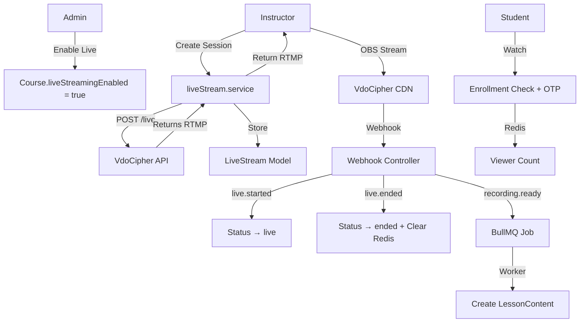

# VdoCipher Live Streaming Architecture — Walkthrough

## Summary
Implemented a fully scalable, enterprise-grade live streaming architecture using VdoCipher Live API across **17 files** (10 new, 7 modified).

## Architecture Overview

## Files Created

| File | Purpose |
|------|---------|
| [liveStream.model.ts](file:///home/aditya-kbr/Desktop/2026/eduApp/server/src/models/course/liveStream.model.ts) | Rewritten with ILiveStream interface, idempotency guards, compound indexes |
| [vdocipher-live.service.ts](file:///home/aditya-kbr/Desktop/2026/eduApp/server/src/services/upload/vdocipher-live.service.ts) | VdoCipher Live API client (create, info, end, OTP) |
| [liveStream.service.ts](file:///home/aditya-kbr/Desktop/2026/eduApp/server/src/services/liveStream/liveStream.service.ts) | Core business logic with transactions |
| [liveStream.controller.ts](file:///home/aditya-kbr/Desktop/2026/eduApp/server/src/controllers/liveStream/liveStream.controller.ts) | 6 endpoints: instructor, admin, student |
| [liveStream.webhook.controller.ts](file:///home/aditya-kbr/Desktop/2026/eduApp/server/src/controllers/liveStream/liveStream.webhook.controller.ts) | HMAC-verified, idempotent webhook handler |
| [liveStream.route.ts](file:///home/aditya-kbr/Desktop/2026/eduApp/server/src/routes/liveStream/liveStream.route.ts) | Routes with auth + permission + ownership middleware |
| [isInstructorOfCourse.ts](file:///home/aditya-kbr/Desktop/2026/eduApp/server/src/middlewares/custom/isInstructorOfCourse.ts) | Course ownership validation middleware |
| [liveStream.queue.ts](file:///home/aditya-kbr/Desktop/2026/eduApp/server/src/bull/queues/liveStream.queue.ts) | BullMQ queue for recording jobs |
| [liveStream.worker.ts](file:///home/aditya-kbr/Desktop/2026/eduApp/server/src/bull/workers/liveStream.worker.ts) | Worker: recording → LessonContent creation |
| [liveViewerCounter.ts](file:///home/aditya-kbr/Desktop/2026/eduApp/server/src/utils/liveViewerCounter.ts) | Redis viewer count (incr/decr/get/clear) |

## Files Modified

| File | Change |
|------|--------|
| [permissions.ts](file:///home/aditya-kbr/Desktop/2026/eduApp/server/src/constants/permissions.ts) | Added `MANAGE_LIVE_STREAM`, `VIEW_LIVE_STREAM` |
| [rolePermissions.ts](file:///home/aditya-kbr/Desktop/2026/eduApp/server/src/constants/rolePermissions.ts) | Assigned live permissions to INSTRUCTOR + STUDENT |
| [errorCodes.ts](file:///home/aditya-kbr/Desktop/2026/eduApp/server/src/constants/errorCodes.ts) | Added 5 live streaming error codes |
| [bullmq.config.ts](file:///home/aditya-kbr/Desktop/2026/eduApp/server/src/bull/config/bullmq.config.ts) | Added LIVE_STREAM queue + job names |
| [course.model.ts](file:///home/aditya-kbr/Desktop/2026/eduApp/server/src/models/course/course.model.ts) | Added `liveStreamingEnabled` field |
| [routes/index.ts](file:///home/aditya-kbr/Desktop/2026/eduApp/server/src/routes/index.ts) | Mounted `/api/v1/live-streams` |
| [webhook.route.ts](file:///home/aditya-kbr/Desktop/2026/eduApp/server/src/routes/webHook/webhook.route.ts) | Added `/vdocipher/live` webhook |

## API Endpoints

| Method | Path | Role | Description |
|--------|------|------|-------------|
| `POST` | `/api/v1/live-streams` | Instructor | Create live session |
| `GET` | `/api/v1/live-streams/instructor` | Instructor | List streams |
| `GET` | `/api/v1/live-streams/instructor/:id/credentials` | Instructor | Get RTMP credentials |
| `PATCH` | `/api/v1/live-streams/courses/:courseId/enable` | Admin | Enable live for course |
| `PATCH` | `/api/v1/live-streams/courses/:courseId/disable` | Admin | Disable live for course |
| `GET` | `/api/v1/live-streams/student/course/:courseId` | Student | Watch live stream |
| `POST` | `/api/v1/webhooks/vdocipher/live` | VdoCipher | Webhook handler |

## Security Measures
- `streamKey` and `chatSecret` are `select: false` — never returned to students
- Webhook signature verified with HMAC-SHA256 + timing-safe comparison
- Idempotency via `webhookProcessedEvents` array + `recordingProcessed` flag
- Enrollment verification for student access
- Course ownership validation via [isInstructorOfCourse](file:///home/aditya-kbr/Desktop/2026/eduApp/server/src/middlewares/custom/isInstructorOfCourse.ts#9-81) middleware
- Admin override allowed on all ownership checks

## Verification
- ✅ **TypeScript compilation**: `npx tsc --noEmit` — **zero errors**
